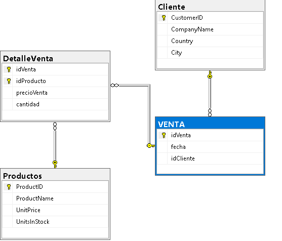

# Documentación del Sistema de Ventas (SQL Server)

## Introducción

Imagina que necesitas registrar ventas en un sistema, pero bien hecho, sin que se rompa nada si algo falla. Este proyecto justamente resuelve eso: se construyó una base de datos que permite gestionar clientes, productos y ventas, validando siempre la información antes de guardarla.

Porque al final, ¿de qué sirve registrar una venta si el cliente no existe o no hay stock suficiente?

---

## Creación de la Base de Datos

Primero se crea la base de datos donde se almacenará toda la información del sistema:

```sql
CREATE DATABASE dbejercicio;
GO
```
Aquí comienza todo el sistema, es el espacio donde se estructuran las tablas y relaciones.

Creación de Tablas
Tabla VENTA
```sql
CREATE TABLE VENTA
(
idVenta INT IDENTITY(1,1),
fecha DATETIME,
idCliente NCHAR(5),

CONSTRAINT pk_Ventas PRIMARY KEY (idVenta),

FOREIGN KEY (idCliente)
REFERENCES Cliente(CustomerID)
);
```
Esta tabla almacena cada venta realizada. Contiene un identificador único autoincremental, la fecha en la que se realiza la venta y el cliente asociado. Funciona como la cabecera de cada operación.

Tabla DetalleVenta
```sql
CREATE TABLE DetalleVenta
(
idVenta INT NOT NULL,
idProducto INT NOT NULL,
precioVenta MONEY NOT NULL,
cantidad INT NOT NULL,

CONSTRAINT PK_DetalleVenta 
PRIMARY KEY (idVenta,idProducto),

CONSTRAINT fk_DV_Venta
FOREIGN KEY (idVenta)
REFERENCES VENTA(idVenta),

CONSTRAINT fk_DV_Producto
FOREIGN KEY (idProducto)
REFERENCES Productos(ProductID)
);
```
Esta tabla representa el detalle de cada venta. Aquí se registra qué producto se vendió, en qué cantidad y a qué precio. Está relacionada tanto con la tabla de ventas como con la de productos.

Carga de Datos desde Northwind

Para facilitar las pruebas, se utilizan datos existentes de la base Northwind.
Productos
```sql

SELECT 
ProductID,
ProductName,
UnitPrice,
UnitsInStock
INTO Productos
FROM NORTHWND.dbo.Products;
```
Se crea la tabla Productos con información relevante como precio y stock disponible.

Clientes
```sql
SELECT 
CustomerID,
CompanyName,
Country,
City
INTO Cliente
FROM NORTHWND.dbo.Customers;
```
Se crea la tabla Cliente con información básica de los clientes.

## Diagrama con relaciones echas


## REQUERIMIENTOS

Crear un store procedure que registre una venta.

1. Manejo de errores y transacciones
2. Inserten Venta, que incluya la fecha actual y el cliente que la realizó (verificar si el cliente existe)
3. Registren el detalle con un solo producto (verificar si el producto existe), deben obtener el precio actual del producto (para insertarlo en detalle de venta), también se debe verificar que el producto tenga suficiente existencia
4.	Actualizar la existencia con la cantidad vendida

## Procedimiento Almacenado: sp_RegistrarVenta

Este procedimiento es el encargado de registrar una venta completa, asegurando que todos los datos sean válidos antes de realizar cualquier operación en la base de datos.

Flujo del Procedimiento
Validación de Cliente
```sql
IF NOT EXISTS (SELECT 1 FROM Cliente WHERE CustomerID = @idCliente)
```
Se verifica que el cliente exista. Si no existe, el proceso se detiene.

Validación de Producto
```sql
IF NOT EXISTS (SELECT 1 FROM Productos WHERE ProductID = @idProducto)
```
Se valida que el producto exista antes de continuar.

Obtención de Precio y Stock
```sql
SELECT 
    @precio = UnitPrice,
    @stock = UnitsInStock
FROM Productos
```
Se obtienen los valores necesarios para la venta: precio actual y cantidad disponible.

Validación de Existencia
```sql
IF @stock < @cantidad
```
Se verifica que haya suficiente inventario para cubrir la venta.

Inicio de Transacción
```sql
BEGIN TRANSACTION;
```
Se inicia una transacción para asegurar que todas las operaciones se ejecuten de manera completa o no se ejecuten en absoluto.

Inserción de Venta
```sql
INSERT INTO VENTA (fecha, idCliente)
VALUES (GETDATE(), @idCliente);
```
Se registra la venta en la tabla principal.

Obtención del ID generado
```sql
SET @idVenta = SCOPE_IDENTITY();
```
Se obtiene el identificador de la venta recién creada.

Inserción del Detalle
```sql
INSERT INTO DetalleVenta (idVenta, idProducto, precioVenta, cantidad)
```
Se registra el detalle de la venta, incluyendo producto, cantidad y precio.

Actualización de Stock
```sql
UPDATE Productos
SET UnitsInStock = UnitsInStock - @cantidad
```
Se descuenta la cantidad vendida del inventario.

Confirmación de Transacción
```sql
COMMIT;
```
Se confirman los cambios realizados en la base de datos.

Manejo de Errores
```sql
BEGIN CATCH
    IF @@TRANCOUNT > 0
        ROLLBACK;
```
Si ocurre un error, se revierte toda la transacción para evitar inconsistencias en los datos.

## Conclusión

Este sistema implementa una lógica sólida para el registro de ventas. Valida la existencia de clientes y productos, verifica el stock disponible y utiliza transacciones para garantizar la integridad de los datos.

Además, mantiene una estructura clara que facilita su mantenimiento y escalabilidad.